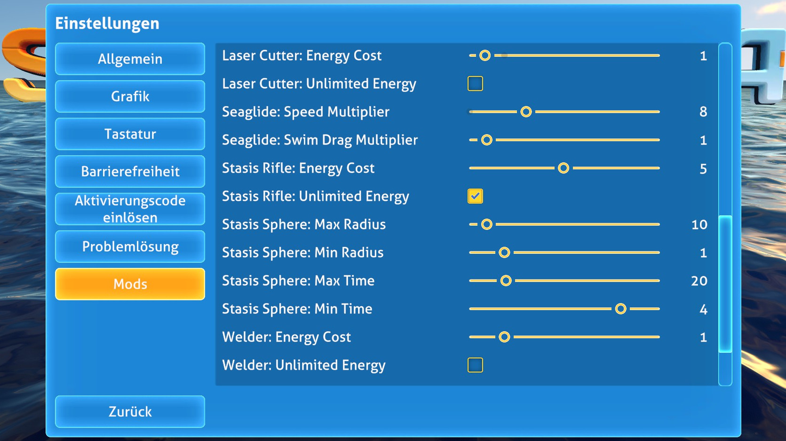

# Alexius25´s Subnautica-Mods
All my Subnautica Mods

# Current Mods:

  
<strong>Subnautica Tool Config</strong>

  

    
    
    
  

   

  **Beschreibung:**  
  Mit diesem Mod kannst du Werkzeuge konfigurieren und anpassen.

  **Voraussetzungen:**
  - Subnautica (aktuelle Version)
  - [Nautilus](https://github.com/SnitramNed/Nautilus) installiert
  - .NET Framework 4.7.2 oder höher

