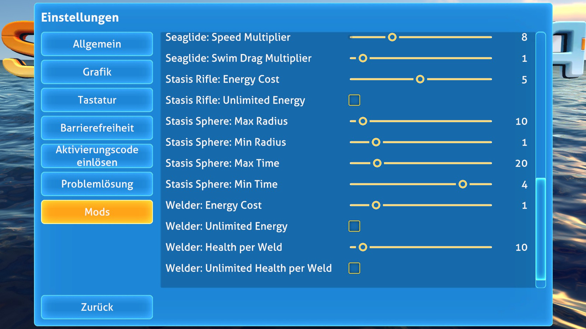
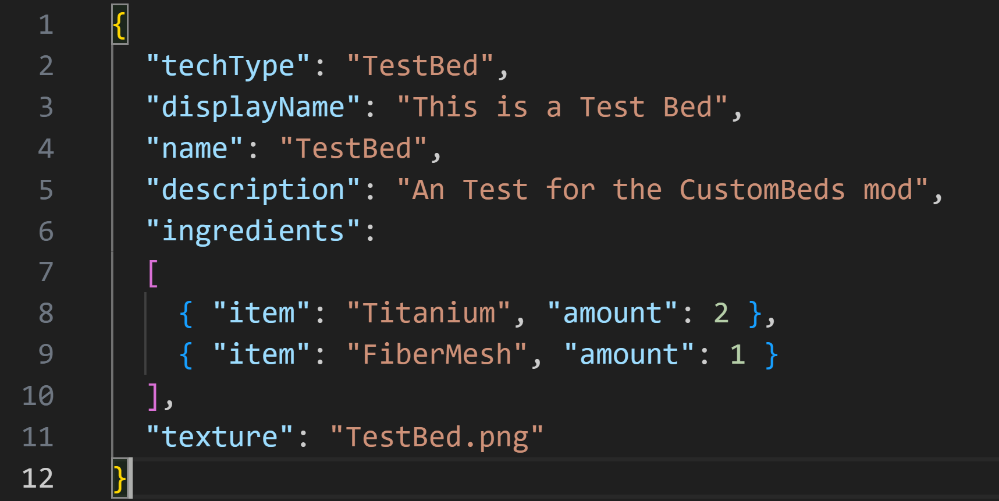

# Alexius25´s Subnautica-Mods
All my Subnautica Mods

# Current Mods:

  
<strong>Subnautica Tool Config</strong>

  

    
    
  

   

  **Description:**  
  With this Mod you can change Tool Values

  **Required Mods:**
  - Nautilus: [GitHub](https://github.com/SubnauticaModding/Nautilus) / [Nexus Mods](https://www.nexusmods.com/subnautica/mods/1262)

  **Download:**
  - [Github Release](https://github.com/Alexius25/Subnautica-Mods/releases)
  

  
<strong>Subnautica Custom Beds</strong>

  **Description:**  
  With this Mod you can make Custom Beds using png and json files

  **How to Make Custom Beds:**

  **1. Json File**
  

    
  

   

  **Required Mods:**
  - Nautilus: [GitHub](https://github.com/SubnauticaModding/Nautilus) / [Nexus Mods](https://www.nexusmods.com/subnautica/mods/1262)

  **Download:**
  - None (Currently)
  

