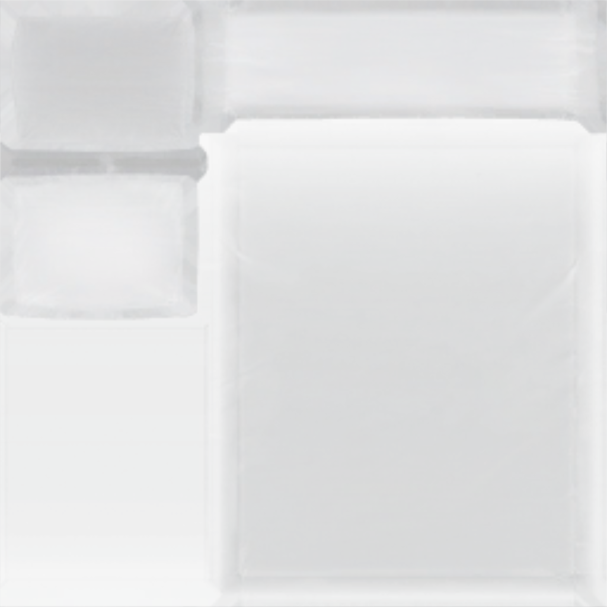

# Custom Beds
## User Guide

<div align=center>
   


</div>

### Automatic Bed-Pack Installation (Recommended)

1. Open the Settings Menu
2. Choose the Mods Option at the Bottom
3. Expand the CustomBed Config section.
4. Click the Automatic Bed Install button to install the bed pack with one click.
5. When prompted, select your Bed-Pack ZIP files in the Windows file picker and click Open
6. A message box will appear showing the installation results
7. Restart the Game
8. That's it — enjoy your new beds!


### Manual Installation

1. In the Mods tab of the Settings menu, click the "Open CustomBed Folder" button
2. Extract your ZIP files into the folder (subfolders are supported)
3. Restart the game
4. That's it — enjoy your new beds!


## Bed Developer Guide

To develop a bed pack for this mod, you’ll need to edit a texture (.png) file and a JSON configuration file.

### Requirements
- A text editor, such as the pre-installed Notepad on Windows (I personally recommend [Visual Studio Code](https://code.visualstudio.com/) from Microsoft)
- An image editor, like [GIMP](https://www.gimp.org/), [Photoshop](https://www.adobe.com/de/products/photoshop.html), or a similar program
- A basic understanding of how to use the image and text editor
- Original Texture from the Game:

<div align=center>
   


</div>

### Texture Editing Guide
To guide you in editing the texture, refer to the image below.
Each section of the image corresponds to a different part of the bed model in the game (pillow, matress and blanket).
The Different Bed types have different Components.

| Bed Type | Double Bed 1 (Bed1) | Double Bed 2 (Bed2) | Single Bed (NarrowBed) |
|----------|---------------------|---------------------|------------------------|
| Pillow 1 |         Yes         |         Yes         |           Yes          |
| Pillow 2 |         Yes         |         Yes         |           No           |
| Matress  |         Yes         |         Yes         |           Yes          |
| Blanket  |          No         |         Yes         |           Yes          |

**Notes:**
   -  The second pillow is always a mirrored version of the first pillow.
   -  The Upper Pillow texture part is the bottom Side of the Pillow.
   -  Please also ensure that the sides of the matress are covered with your image/texture.
   -  The Original Texture must be the upper most layer in your image editor.   

<div align=center>
   


</div>


### Config File Guide

To have your bed recognized by the mod, you must provide a configuration file named Config.json.
This file contains crucial information the mod needs to properly register your bed.

Here are the fields required in the Config.json

| Field            | Description                                                                                               |   
| ---------------- | ----------------------------------------------------------------------------------------------------------|
| `techType`       | Unique identifier for your custom bed.                                                                    |
| `unlockTechType` | The tech type required to unlock this bed in-game (e.g., `"Bed1"`).                                       |
| `displayName`    | The name shown to players for your bed.                                                                   |
| `name`           | Internal name of your bed (usually the same as `techType`).                                               |
| `description`    | Short description of the bed, visible in the game UI.                                                     |
| `ingredients`    | List of required crafting materials and their quantities.                                                 |
| `texture`        | Filename of the bed’s texture PNG (must match your edited texture file).                                  |
| `bedType`        | The bed model type, matching one of the predefined bed types (`"Bed1"`, `"Bed2"` or `"NarrowBed`")  |

**Example Config.json:**

```json
{
  "techType": "TestBed4",
  "unlockTechType": "Bed1",
  "displayName": "TestBed4",
  "name": "TestBed4",
  "description": "TestBed4",
  "ingredients": 
  [
    { "item": "Titanium", "amount": 2 },
    { "item": "FiberMesh", "amount": 1 }
  ],
  "texture": "TestBed4.png",
  "bedType": "Bed1"
}
```

**A full List of TechTypes can be found [here](https://subnautica.fandom.com/wiki/Spawn_IDs_(Subnautica))**

### Packaging your Bed-Pack

There are many ways to package your CustomBeds. Here are the Two best options:

#### Packaging a Single Bed
If you only have one Bed this Option is the Best. You want to make a folder in wich you have your Config.json and the texture (.png file)
Heres an Example of how the Folder Structure could look like:
```
BedName/
├─ Config.json
├─ TextureName.png
```

Now you can use a programm like [Winrar](https://www.win-rar.com/start.html?&L=0) or [7-Zip](https://7-zip.org/) to make your Bed Folder into a ZIP that you can upload on [Nexus Mods](https://www.nexusmods.com/). Now the Folder Structure should look like this:
```
BedName.zip/
├─ BedName/
│  ├─ Config.json
│  ├─ TextureName.png
```

#### Packaging Multiple Beds
If you only have multiple Beds you want to package in one ZIP this Option is the Best. You want to make a folder with the name of your bedpack and in this folder you make folders for each of your beds.
Heres an Example of how the Folder Structure could look like:
```
BedPackName/
├─ BedName1/
│  ├─ Config.json
│  ├─ TextureName.png
├─ BedName2/
│  ├─ Config.json
│  ├─ TextureName.png
├─ BedName3/
│  ├─ Config.json
│  ├─ TextureName.png
```

Now you can again use a programm like [Winrar](https://www.win-rar.com/start.html?&L=0) or [7-Zip](https://7-zip.org/) to make your Bed Folder into a ZIP that you can upload on [Nexus Mods](https://www.nexusmods.com/). Now the Folder Structure should look like this:

```
BedPackName.zip
├─ BedPackName/
│  ├─ BedName1/
│  │  ├─ Config.json
│  │  ├─ TextureName.png
│  ├─ BedName2/
│  │  ├─ Config.json
│  │  ├─ TextureName.png
│  ├─ BedName3/
│  │  ├─ Config.json
│  │  ├─ TextureName.png
```

**Note:** You can find working examples [here](https://github.com/Alexius25/Subnautica-Mods/tree/c7cf3501457c6fd38f1911b9b1a70161fe48ee39/docs/CustomBedsExamples)
