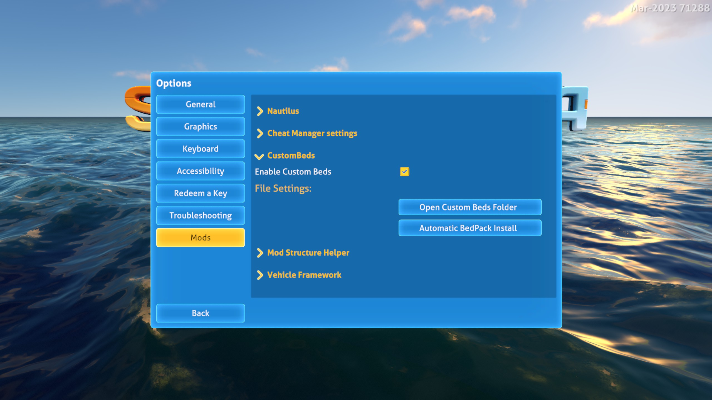
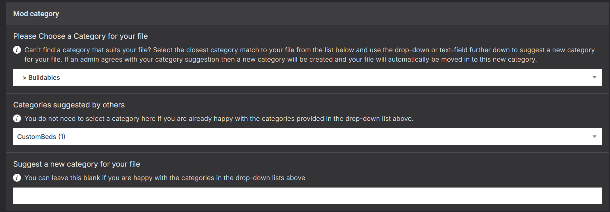
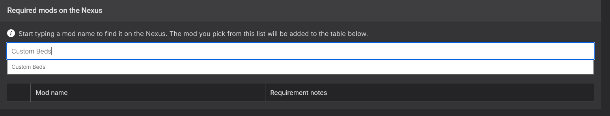
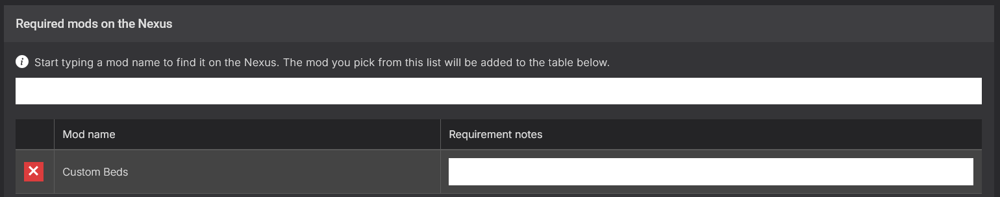

# Custom Beds  
## User Guide

<div align="center">  
  
</div>

### Automatic Bed-Pack Installation (Recommended)

1. Open the **Settings** menu.  
2. Select the **Mods** option at the bottom.  
3. Expand the **CustomBed Config** section.  
4. Click the **Automatic Bed Install** button to install the bed pack with one click.  
5. When prompted, select your Bed-Pack ZIP files in the Windows file picker and click **Open**.  
6. A message box will appear showing the installation results.  
7. Restart the game.  
8. That’s it — enjoy your new beds!

---

### Manual Installation

1. In the **Mods** tab of the **Settings** menu, click the **Open CustomBed Folder** button.  
2. Extract your ZIP files into the folder (subfolders are supported).  
3. Restart the game.  
4. That’s it — enjoy your new beds!

---

## Bed Developer Guide

To develop a bed pack for this mod, you’ll need a few image files (`.png`) and a JSON configuration file.  
**If you have any questions, message me on Discord (`alexius25.`)**

### Requirements

- A text editor, such as the pre-installed **Notepad** on Windows (I personally recommend [Visual Studio Code](https://code.visualstudio.com/) from Microsoft).
- A basic understanding of how to use a text editor.

---

### Texture Editing Guide

You place your Images in the same folder as your Config.json. You rename the images so they are individual (e.g. BedName_PillowUpper.png, BedName_PillowLower.png, ...)
Each image corresponds to a different part of the bed model in the game (pillow, mattress, and blanket).  
Different bed types have different components:

| Bed Type  | Double Bed 1 (`Bed1`) | Double Bed 2 (`Bed2`) | Single Bed (`NarrowBed`) |
|-----------|------------------------|------------------------|---------------------------|
| Pillow 1  | Yes                    | Yes                    | Yes                       |
| Pillow 2  | Yes                    | Yes                    | No                        |
| Mattress  | Yes                    | Yes                    | Yes                       |
| Blanket   | No                     | Yes                    | Yes                       |

**Note:**  
- The second pillow is always a mirrored version of the first pillow.

### Image Information

This here is for more advanced beds:

| Image/Region         | Width (px) | Height (px) |
|----------------------|------------|-------------|
| pillowUpperTexture   | 335        | 270         |
| pillowLowerTexture   | 335        | 270         |
| blanketTexture       | 690        | 255         |
| mattressTexture      | 650        | 795         |

**Note:**
The Mod automaticly resizes and crops your provided images to fit into the part of the texture, but for best results, your source images should match these aspect ratios as closely as possible to avoid cropping important parts of your image. Aspect Fill is used to automaticly resizes and crops your provided images.


---

### Config File Guide

To have your bed recognized by the mod, you must include a configuration file named `Config.json`.  
This file contains crucial information the mod uses to register your bed properly.

#### Required Fields in `Config.json`:

| Field                  | Description                                                                 |
|------------------------|-----------------------------------------------------------------------------|
| `techType`             | Unique identifier for your custom bed.                                      |
| `unlockTechType`       | The tech type required to unlock this bed in-game (e.g., `"Bed1"`).         |
| `displayName`          | The name shown to players for your bed.                                     |
| `description`          | A short description of the bed, shown in the UI.                            |
| `ingredients`          | List of required crafting materials and their quantities.                   |
| `pillowUpperTexture`   | Filename for the front of the pillow texture.                               |
| `pillowLowerTexture`   | Filename for the back of the pillow texture.                                |
| `blanketTexture`       | Filename for the blanket texture.                                           |
| `mattressTexture`      | Filename for the mattress texture.                                          |
| `bedType`              | One of the supported models: `"Bed1"`, `"Bed2"`, or `"NarrowBed"`.          |
| `disableBlanket`       | Disable the Blanket for `"Bed2"` or `"NarrowBed"`.                          |    

**Note:**
- All texture fields can use the same image file.
- No fields are strictly required — default values will be used if they’re missing.

| Field                | Required? | Default Value                          |
|----------------------|-----------|----------------------------------------|
| `techType`           | No        | Auto-generated unique name             |
| `displayName`        | No        | Uses `techType`, or auto-generated name|
| `description`        | No        | "A bed with a custom design."          |
| `unlockTechType`     | No        | `"Bed1"`                               |
| `ingredients`        | No        | 2x Fiber Mesh, 1x Titanium             |
| `pillowUpperTexture` | No        | None (uses vanilla)                    |
| `pillowLowerTexture` | No        | None (uses vanilla)                    |
| `blanketTexture`     | No        | None (uses vanilla)                    |
| `mattressTexture`    | No        | None (uses vanilla)                    |
| `bedType`            | No        | `"Bed1"`                               |
| `disableBlanket`     | No        | `false"`                               |

---

**Example `Config.json`:**

```json
{
  "techType": "TestBed",
  "displayName": "Test Bed",
  "description": "This is a test bed.",
  "unlockTechType": "Bed1",
  "ingredients": [
    { "item": "Titanium", "amount": 2 },
    { "item": "FiberMesh", "amount": 1 }
  ],
  "pillowUpperTexture": "TestBedV2.png",
  "pillowLowerTexture": "TestBedV2.png",
  "blanketTexture": "TestBedV2.png",
  "mattressTexture": "TestBedV2.png",
  "bedType": "Bed1",
  "disableBlanket": false
}
```

**A full List of TechTypes can be found [here](https://subnautica.fandom.com/wiki/Spawn_IDs_(Subnautica))**

### Packaging your Bed Pack

There are two ways to package your Custom Beds:

---

#### Option 1: Single Bed
If you're distributing just one bed, this is the recommended method.
Create a folder containing your Config.json and .png texture file(s).
**Example folder structure:**
```
BedName/
├─ Config.json
|─ Texture1Name.png
├─ Texture2Name.png
|─ Texture3Name.png
├─ Texture4Name.png
```
Then use a program like [WinRAR](https://www.win-rar.com/start.html?&L=0) or [7-Zip](https://7-zip.org/) to compress the folder into a `.zip` file. The final structure should look like:
```
BedName.zip/
├─ BedName/
│  ├─ Config.json
│  ├─ Texture1Name.png
│  ├─ Texture2Name.png
│  ├─ Texture3Name.png
│  ├─ Texture4Name.png
```
---

#### Option 2: Multiple Beds
If you're packaging multiple beds, create a folder for your Bed Pack, and inside it, create one folder for each bed.
```
BedPackName/
├─ BedName1/
│  ├─ Config.json
│  ├─ Texture1Name.png
│  ├─ Texture2Name.png
│  ├─ Texture3Name.png
│  ├─ Texture4Name.png
├─ BedName2/
│  ├─ Config.json
│  ├─ Texture1Name.png
│  ├─ Texture2Name.png
│  ├─ Texture3Name.png
│  ├─ Texture4Name.png
├─ BedName3/
│  ├─ Config.json
│  ├─ Texture1Name.png
│  ├─ Texture2Name.png
│  ├─ Texture3Name.png
│  ├─ Texture4Name.png
```

Compress the Bedpack folder into a ZIP file. The structure should look like:

```
BedPackName.zip
├─ BedPackName/
│  ├─ BedName1/
│  │  ├─ Config.json
│  │  ├─ Texture1Name.png
│  │  ├─ Texture2Name.png
│  │  ├─ Texture3Name.png
│  │  ├─ Texture4Name.png
│  ├─ BedName2/
│  │  ├─ Config.json
│  │  ├─ Texture1Name.png
│  │  ├─ Texture2Name.png
│  │  ├─ Texture3Name.png
│  │  ├─ Texture4Name.png
│  ├─ BedName3/
│  │  ├─ Config.json
│  │  ├─ Texture1Name.png
│  │  ├─ Texture2Name.png
│  │  ├─ Texture3Name.png
│  │  ├─ Texture4Name.png
```

**Note:** You can find working examples [here](https://github.com/Alexius25/Subnautica-Mods/tree/gh-pages/docs/CustomBedsExamples)


### Releasing Your Mod on Nexus Mods

There are a few important things to keep in mind when releasing your Bedpack on Nexus Mods.

First, the Mod Category:
<div align="center">  </div>

Please use the category Custom Beds for easier identification of custom beds.

Second, the Requirements:
<div align="center">  </div>

Now click on Custom Beds. It should now look like this:
<div align="center">  </div>


**The rest is up to you. Happy modding!**
