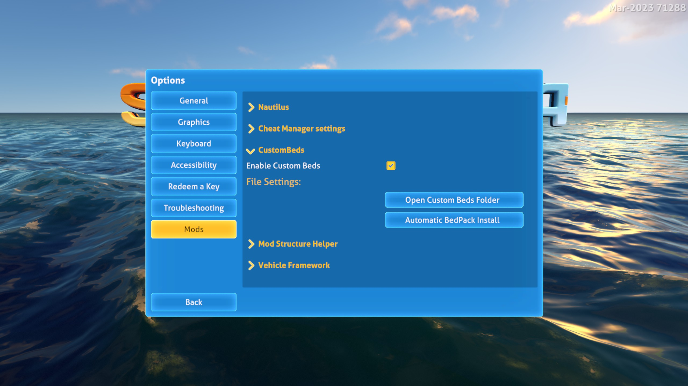

# Custom Beds: User Guide

## Automatic Bed-Pack install (Recommended)

1. Open the Settings Menu
2. Choose the Mods Option at the Bottom
   

3. Unfold the CustomBed Config
4. Press the Automatic Bed Install Button
